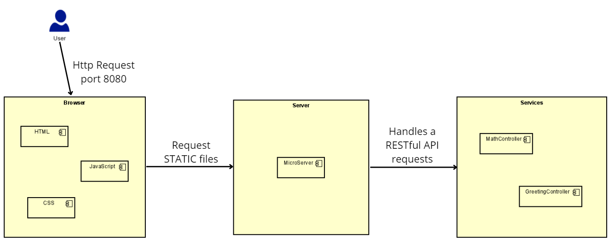
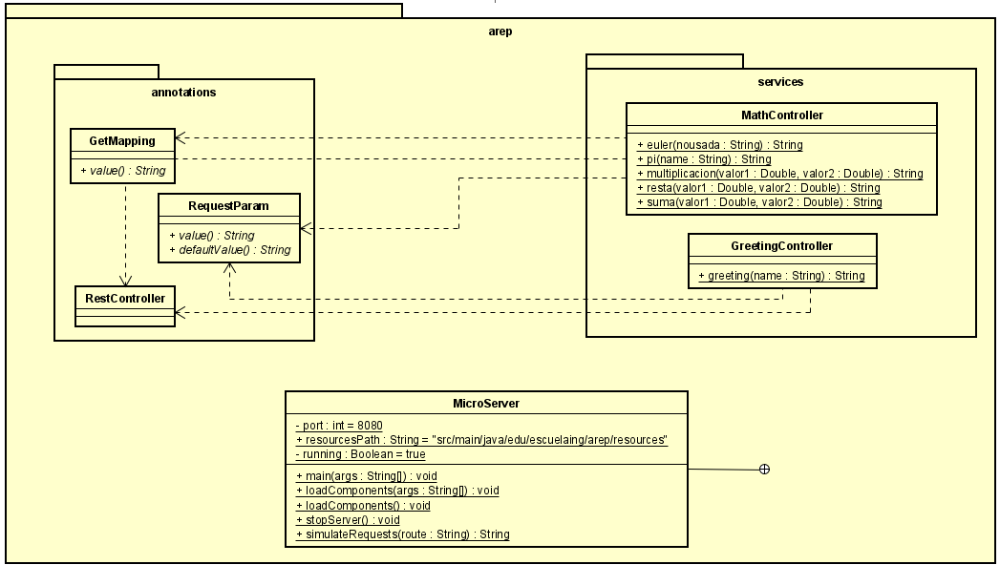
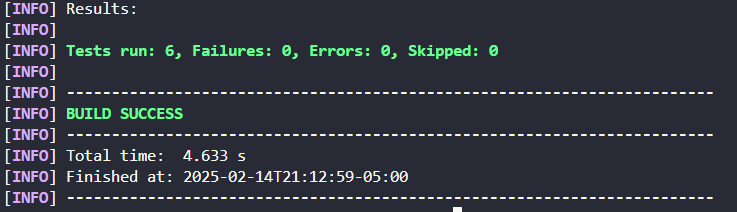

# MicroSpring
 
In this project we will review a lightweight web server  without using Spring Boot. It processes custom annotations to expose RESTful web services dynamically. The main goal of this project is to build a micro-framework, allowing developers to define controllers, endpoints, and request parameters using Java annotations.


## Getting Started

These instructions will get you a copy of the project up and running on your local machine for development and testing purposes.

### Prerequisites

You need to install the following tools to run the project:
1. Java
    ```
    java -version
    ```
    It should appear something like this:
    ```
    java version "17.0.10" 2024-01-16 LTS
    Java(TM) SE Runtime Environment (build 17.0.10+11-LTS-240)
    Java HotSpot(TM) 64-Bit Server VM (build 17.0.10+11-LTS-240, mixed mode, sharing)
    ```
2. Maven
    ```
    mvn -version
    ```
    It should appear something like this:
    ```
    Apache Maven 3.9.6 (bc0240f3c744dd6b6ec2920b3cd08dcc295161ae)
    Maven home: C:\workspace\apache-maven-3.9.6-bin\apache-maven-3.9.6
    Java version: 17.0.10, vendor: Oracle Corporation, runtime: C:\Program Files\Java\jdk-17
    Default locale: es_CO, platform encoding: Cp1252
    OS name: "windows 11", version: "10.0", arch: "amd64", family: "windows"
    ```
3. Git
    ```
    git --version
    ```
    It should appear something like this:
    ```
    git version 2.44.0
    ```

### Installing

1. Clone this repository and go to project directory:
    ```
    git clone https://github.com/oscar0617/Lab03-AREP-MicroSpring

    cd Lab03-AREP-MicroSpring
    ```
2. Build the project:
    ```
    mvn package
    ```
    Should appear something like this:
    ```
    [INFO] Building jar: C:\Users\luzma\Desktop\AREP\Lab03-AREP-MicroSpring\target\Lab03-AREP-MicroSpring-1.0-SNAPSHOT.jar
    [INFO] ------------------------------------------------------------------------
    [INFO] BUILD SUCCESS
    [INFO] ------------------------------------------------------------------------
    ```
3. Run the project:
    ```
    java -cp target/Lab03-AREP-MicroSpring-1.0-SNAPSHOT.jar edu.escuelaing.arep.MicroServer
    ```
    Should appear something like this:
    ```
    Cargue el servicio: /greeting
    Cargue el servicio: /pi
    Cargue el servicio: /e
    Cargue el servicio: /resta
    Cargue el servicio: /multiplicacion
    Cargue el servicio: /suma
    Listo para recibir ...
    ```
Now you are able to access into the ```index.html```. Using the following URL: ```http://localhost:8080/index.html```

## Architecture



#### Overview

This architecture diagram illustrates the request flow in the **MicroSpring Server** system. It consists of three main components:

1. **Browser (Client)**
2. **MicroServer (Backend Server)**
3. **Services (RESTful API Controllers)**

##### Components and Workflow

##### **1. Browser (Client)**
The user interacts with the system through a web browser, which:
- Sends HTTP requests to the server on port **8080**.
- Requests **static files** such as:
  - **HTML** (for page structure).
  - **JavaScript** (for dynamic behavior).
  - **CSS** (for styling).

##### **2. MicroServer (Backend Server)**
The `MicroServer` is the core of the system and is responsible for:
- Handling **static file requests** from the browser.
- Serving **RESTful API requests** by routing them to the appropriate service.
- Processing requests dynamically using custom annotations.

##### **3. Services (RESTful API Controllers)**
The `MicroServer` delegates RESTful requests to controllers inside the **Services** module, which contains:
- **MathController**
  - Handles mathematical operations such as addition, subtraction, multiplication, and retrieving constants like **pi** and **e**.
- **GreetingController**
  - Processes requests related to greeting messages.

##### Request Flow

1. The user sends an HTTP request to **port 8080** from the browser.
2. If the request is for a **static file** (HTML, JavaScript, CSS), the **MicroServer** responds with the requested file.
3. If the request is for a **RESTful API endpoint**, the **MicroServer** forwards it to the appropriate controller in the **Services** module.
4. The controller processes the request and returns the corresponding response.
5. The **MicroServer** sends the response back to the browser.


## Class Diagram


#### Overview

The class diagram represents the **MicroSpring Server**, showing its key components, relationships, and responsibilities. The system is structured into three main packages:

1. **`annotations`** - Defines custom annotations to handle RESTful requests.
2. **`services`** - Implements controllers that process HTTP requests.
3. **`MicroServer`** - The core server responsible for managing HTTP requests and invoking annotated methods.

###### **Annotations Package**
This package contains custom annotations used for defining RESTful endpoints:

- **`@GetMapping`**
  - Defines a mapping between a URL path and a method.
  - Has a `value()` attribute that specifies the endpoint URL.

- **`@RequestParam`**
  - Defines query parameters in HTTP requests.
  - Attributes:
    - `value()`: The name of the query parameter.
    - `defaultValue()`: A default value if the parameter is not provided.

- **`@RestController`**
  - Marks a class as a REST controller, allowing it to handle HTTP requests.


###### **Services Package**
This package contains controllers that process HTTP requests and return responses:

###### **MathController**
Handles mathematical operations:

- **`euler(nousada: String) : String`**
  - Returns Euler's constant (`2.718281828459045`).

- **`pi(name: String) : String`**
  - Returns the value of π (`3.141592653589793`).

- **`multiplicacion(valor1: Double, valor2: Double) : String`**
  - Multiplies two numbers and returns the result.

- **`resta(valor1: Double, valor2: Double) : String`**
  - Subtracts `valor2` from `valor1` and returns the result.

- **`suma(valor1: Double, valor2: Double) : String`**
  - Adds `valor1` and `valor2` and returns the result.

###### **GreetingController**
Handles a simple greeting message:

- **`greeting(name: String) : String`**
  - Returns a greeting message based on the provided `name`.

###### **MicroServer Class**
The `MicroServer` class is the **core** of the application, responsible for:

- Managing the server lifecycle.
- Handling incoming HTTP requests.
- Loading components dynamically using reflection.

###### **Attributes**
- **`port : int = 8080`** → The server runs on port `8080`.
- **`resourcesPath : String = "src/main/java/edu/escuelaing/arep/resources"`** → Directory for serving static files.
- **`running : Boolean = true`** → Indicates whether the server is running.

###### **Methods**
- **`main(args: String[]) : void`**
  - Starts the server and listens for client connections.

- **`loadComponents(args: String[]) : void`**
  - Dynamically loads annotated service components from a specified package.

- **`loadComponents() : void`**
  - Alternative method to load services without arguments.

- **`stopServer() : void`**
  - Stops the server execution.

- **`simulateRequests(route: String) : String`**
  - Simulates a request to an endpoint by invoking the corresponding method.

###### **Relationships and Interactions**
- **Annotations → Services**
  - The `@RestController`, `@GetMapping`, and `@RequestParam` annotations define how services handle requests.
  
- **MicroServer → Services**
  - The server dynamically detects and registers services marked with `@RestController`.

- **MicroServer → Annotations**
  - Uses reflection to scan for `@GetMapping` and `@RequestParam` annotations, mapping URLs to methods.


## Running the tests

The following unit tests were created to validate the functionality of the `MicroServer` class. These tests ensure that each component of the server behaves as expected.

#### **1. `testGreetingEndpoint`**
- **Purpose**: Validates that the `/greeting` endpoint returns the expected response.
- **What it tests**:
  - When requested, it should return `"Hola Mundo"`.
  - Expected HTTP response: `200 OK` with body `"Hola Mundo"`.

#### **2. `testEulerEndpoint`**
- **Purpose**: Ensures that the `/e` endpoint correctly returns Euler’s constant.
- **What it tests**:
  - Returns `"2.718281828459045"` as expected.

#### **3. `testPiEndpoint`**
- **Purpose**: Ensures that the `/pi` endpoint returns the value of pi.
- **What it tests**:
  - Returns `"3.141592653589793"` as expected.

#### **4. `testMultiplicacionEndpoint`**
- **Purpose**: Validates that the multiplication operation works as expected.
- **What it tests**:
  - Request: `/multiplicacion?valor1=2&valor2=3`
  - Expected response: `"6.0"`.

#### **5. `testRestaEndpoint`**
- **Purpose**: Ensures that the substraction operation returns the correct value.
- **What it tests**:
  - Request: `/resta?valor1=5&valor2=3`
  - Expected response: `"2.0"`.

#### **6. `testSumaEndpoint`**
- **Purpose**: Ensures that the addition operation returns the correct value.
- **What it tests**:
  - Request: `/suma?valor1=4&valor2=6`
  - Expected response: `"10.0"`.



## Conclusion

The **MicroSpring Server** project successfully demonstrates the implementation of a lightweight, annotation-based web framework built from scratch in Java. By leveraging Java reflection and custom annotations, the server dynamically registers and processes RESTful endpoints, similar to traditional frameworks like Spring Boot but without external dependencies.


## Built With

* [Maven](https://maven.apache.org/) - Dependency Management
* [GIT](https://git-scm.com) - Version control


## Versioning

I use [GitHub](http://git-scm.com) for versioning.

## Authors

* **Oscar Santiago Lesmes Parra** - [oscar0617](https://github.com/oscar0617)

Date: 07/02/2025
## License

This project is licensed under the GNU.

